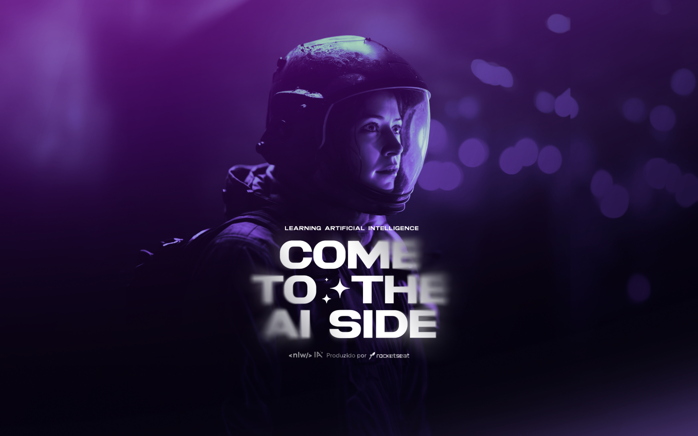

## NLW IA | Trilha Mastery

Projeto desenvolvido na 13ª edição do NLW promovido pela Rocketseat 🚀 #NextLevelWeek #NeverStopLearning

## Tecnologias

- WEB
  - [React](https://react.dev/)
  - [Tailwindcss](https://tailwindcss.com/)
  - [Radix-UI](https://www.radix-ui.com/)
  - [Vite](https://vitejs.dev/)
  - [ffmpeg](https://ffmpegwasm.netlify.app/docs/overview)
  - [Shadcn](https://ui.shadcn.com/docs)

- API
  - [Prisma](https://www.prisma.io/)
  - [Fastify](https://fastify.dev/)
  - [OpenAI](https://openai.com/blog/openai-api)

    <a href="https://www.loom.com/share/89232699151d4db3b28164a3746932d5">
      
Screen

    </a>
    

